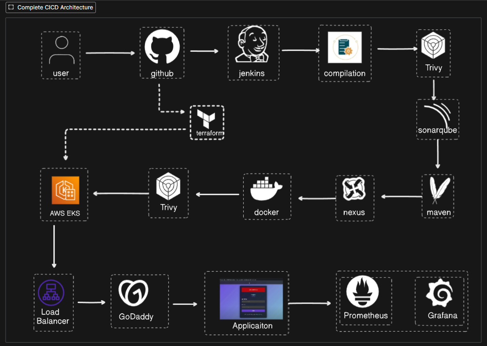

# 🚀 Complete DevOps CI/CD Pipeline

A comprehensive end-to-end DevOps pipeline featuring Jenkins, SonarQube, Nexus, Docker, Kubernetes (EKS), Terraform, Prometheus, Grafana, and automated monitoring.

## 📋 Table of Contents

- [Architecture Overview](#architecture-overview)
- [Prerequisites](#prerequisites)
- [Installation Guide](#installation-guide)
- [Configuration](#configuration)
- [Pipeline Workflow](#pipeline-workflow)
- [Monitoring Setup](#monitoring-setup)
- [Domain Configuration](#domain-configuration)
- [Troubleshooting](#troubleshooting)
- [Contributing](#contributing)

## 🏗️ Architecture Overview

<div align="center">
  
</div>

This pipeline implements a complete CI/CD workflow with:

- **CI/CD**: Jenkins for automation
- **Code Quality**: SonarQube for static code analysis
- **Artifact Management**: Nexus Repository
- **Security Scanning**: Trivy for container vulnerability scanning
- **Container Orchestration**: Amazon EKS (Kubernetes)
- **Infrastructure as Code**: Terraform
- **Monitoring**: Prometheus + Grafana + Blackbox Exporter
- **Notifications**: Email alerts via Gmail

## 📦 Prerequisites

Before starting, generate the following credentials:

### 1. GitHub Personal Access Token
- Go to GitHub → Settings → Developer Settings → Personal Access Tokens → Tokens (classic)
- Click "Generate new token (classic)"
- Select scopes: `repo`, `workflow`, `admin:repo_hook`
- Generate and save the token securely

### 2. SonarQube Token
- Access SonarQube at `localhost:9000`
- Login with default credentials (`admin:admin`), then change password
- Navigate to Administration → Security → Users
- Click on the tokens icon next to your user
- Generate and save the token

### 3. Docker Personal Access Token
- Go to Docker Hub → Account Settings → Security
- Click "New Access Token"
- Provide a description and generate
- Save the token securely

### 4. Google App Password
- Go to Google Account → Security → 2-Step Verification
- Scroll down to "App passwords"
- Select app: "Mail", device: "Other"
- Generate and save the 16-character password

### 5. AWS Access Keys
- Go to AWS Console → IAM → Users
- Create user with AdministratorAccess policy
- Generate Access Key and Secret Key
- Save both credentials securely

## 🛠️ Installation Guide

### System Requirements
- Ubuntu 20.04 LTS or higher
- Minimum 4GB RAM, 2 CPU cores
- 50GB free disk space

### Step 1: Update System
```bash
sudo apt update
```

### Step 2: Install Java 17
```bash
sudo apt install openjdk-17-jre-headless -y
```
> **Why Java 17?** Jenkins requires Java 17 for optimal performance and LTS support.

### Step 3: Install Jenkins
```bash
sudo wget -O /etc/apt/keyrings/jenkins-keyring.asc \
  https://pkg.jenkins.io/debian-stable/jenkins.io-2023.key
echo "deb [signed-by=/etc/apt/keyrings/jenkins-keyring.asc]" \
  https://pkg.jenkins.io/debian-stable binary/ | sudo tee \
  /etc/apt/sources.list.d/jenkins.list > /dev/null
sudo apt update
sudo apt install jenkins -y
```

### Step 4: Install Docker
```bash
sudo apt install docker.io -y
sudo chmod 666 /var/run/docker.sock
```

### Step 5: Install Trivy (Security Scanner)
```bash
sudo apt-get install wget apt-transport-https gnupg lsb-release -y
wget -qO - https://get.trivy.dev/deb/public.key | gpg --dearmor | sudo tee /usr/share/keyrings/trivy.gpg > /dev/null
echo "deb [signed-by=/usr/share/keyrings/trivy.gpg] https://get.trivy.dev/deb generic main" | sudo tee -a /etc/apt/sources.list.d/trivy.list
sudo apt-get update
sudo apt-get install trivy -y
```

### Step 6: Install AWS CLI
```bash
curl "https://awscli.amazonaws.com/awscli-exe-linux-x86_64.zip" -o "awscliv2.zip"
unzip awscliv2.zip
sudo ./aws/install
rm -rf awscliv2.zip
mv aws ~
```

### Step 7: Install Terraform
```bash
curl -fsSL https://releases.hashicorp.com/terraform/1.5.7/terraform_1.5.7_linux_amd64.zip -o terraform.zip
sudo apt install -y unzip
unzip terraform.zip
sudo mv terraform /usr/local/bin/
terraform --version
```

### Step 8: Install kubectl
```bash
curl -LO "https://dl.k8s.io/release/$(curl -L -s https://dl.k8s.io/release/stable.txt)/bin/linux/amd64/kubectl"
chmod +x kubectl
sudo mv kubectl /usr/local/bin/
kubectl version --client
```

### Step 9: Install Prometheus
```bash
wget https://github.com/prometheus/prometheus/releases/download/v3.6.0/prometheus-3.6.0.linux-amd64.tar.gz
tar -xvf prometheus-3.6.0.linux-amd64.tar.gz
rm prometheus-3.6.0.linux-amd64.tar.gz
mv prometheus-3.6.0.linux-amd64 prometheus
mv prometheus ~
```

### Step 10: Install Blackbox Exporter
```bash
wget https://github.com/prometheus/blackbox_exporter/releases/download/v0.27.0/blackbox_exporter-0.27.0.linux-amd64.tar.gz
tar -xvf blackbox_exporter-0.27.0.linux-amd64.tar.gz
rm blackbox_exporter-0.27.0.linux-amd64.tar.gz
mv blackbox_exporter-0.27.0.linux-amd64 blackbox_exporter
mv blackbox_exporter ~
```

### Step 11: Install Grafana
```bash
sudo apt-get install -y adduser libfontconfig1 musl
wget https://dl.grafana.com/grafana-enterprise/release/12.2.0/grafana-enterprise_12.2.0_17949786146_linux_amd64.deb
sudo dpkg -i grafana-enterprise_12.2.0_17949786146_linux_amd64.deb
sudo /bin/systemctl start grafana-server
```
Default credentials: `admin:admin`

## ⚙️ Configuration

### 1. Start Required Services

#### Jenkins
```bash
# Access Jenkins
http://localhost:8080

# Get initial admin password
sudo cat /var/lib/jenkins/secrets/initialAdminPassword
```

#### Nexus Repository
```bash
sudo docker run -d -p 8200:8081 sonatype/nexus3
# Access at: http://localhost:8200
```

#### SonarQube
```bash
sudo docker run -d -p 9000:9000 sonarqube:lts-community
# Access at: http://localhost:9000
# Default: admin:admin
```

### 2. Jenkins Plugin Installation

Navigate to: **Jenkins → Manage Jenkins → Plugins → Available**

Install the following plugins:
- SonarQube Scanner
- Config File Provider
- Maven Integration
- Pipeline Maven Integration
- Kubernetes
- Kubernetes Credentials
- Kubernetes CLI
- Kubernetes Client API
- Docker
- Docker Pipeline
- Eclipse Temurin Installer
- Pipeline Stage View
- Email Extension Template

### 3. Configure Jenkins Tools

**Jenkins → Manage Jenkins → Tools**

- **Docker**: Install automatically from docker.com (latest)
- **Maven**: Keep default version
- **SonarQube Scanner**: Latest version
- **JDK**: Install JDK 17 automatically

### 4. Configure Credentials

**Jenkins Dashboard → Manage Jenkins → Credentials → Global → Add Credentials**

Add the following credentials:

| Type | Description | ID | Fields |
|------|-------------|-----|--------|
| Username/Password | GitHub | `github-cred` | Username + Personal Access Token |
| Username/Password | Gmail | `mail-cred` | Email + Google App Password |
| Secret Text | SonarQube | `sonar-token` | SonarQube Token |
| Secret Text | Kubernetes | `k8s-cred` | EKS Service Account Token |
| Username/Password | Docker | `docker-cred` | Docker Username + PAT |

### 5. Configure SonarQube Integration

**Jenkins → Manage Jenkins → System → SonarQube Servers**

- Name: `sonar-server`
- Server URL: `http://localhost:9000`
- Authentication Token: Select `sonar-token` credential

### 6. Configure Maven Settings for Nexus

#### Update pom.xml
Add this before the closing `</project>` tag:

```xml
<distributionManagement>
    <repository>
        <id>maven-releases</id>
        <url>http://localhost:8200/repository/maven-releases/</url>
    </repository>
    <snapshotRepository>
        <id>maven-snapshots</id>
        <url>http://localhost:8200/repository/maven-snapshots/</url>
    </snapshotRepository>
</distributionManagement>
```

#### Configure Maven Settings in Jenkins

**Jenkins → Manage Jenkins → Managed Files → Add → Global Maven settings.xml**

- ID: `maven-settings`
- Content: Add server credentials

```xml
<servers>
  <server>
    <id>maven-snapshots</id>
    <username>admin</username>
    <password>admin</password>
  </server>
  <server>
    <id>maven-releases</id>
    <username>admin</username>
    <password>admin</password>
  </server>
</servers>
```

### 7. Configure Email Notifications

**Jenkins → Manage Jenkins → System**

#### Extended E-mail Notification
- SMTP Server: `smtp.gmail.com`
- SMTP Port: `465`
- Use SSL: ✓
- Credentials: Select `mail-cred`

#### E-mail Notification
- SMTP Server: `smtp.gmail.com`
- Advanced → Use SMTP Authentication
- Username: Your Gmail
- Password: Google App Password
- Test configuration by sending test email

## ☸️ Kubernetes (EKS) Setup

### 1. Configure AWS CLI
```bash
aws configure
# Enter AWS Access Key ID
# Enter AWS Secret Access Key
# Default region: ap-south-1
# Default output format: json
```

### 2. Initialize Terraform
```bash
terraform init
terraform plan
terraform apply -auto-approve
```

### 3. Configure kubectl for EKS
```bash
aws eks --region ap-south-1 update-kubeconfig --name rohandevops-cluster
```

### 4. Create Kubernetes Resources
```bash
# Create namespace
kubectl create ns webapps

# Navigate to k8s directory
cd k8s/

# Apply configurations
kubectl apply -f svc.yml
kubectl apply -f role.yml
kubectl apply -f bind.yml
kubectl apply -f jen-sec.yml -n webapps
```

### 5. Create Docker Registry Secret
```bash
kubectl create secret docker-registry regcred \
  --docker-server=https://index.docker.io/v1/ \
  --docker-username=<your-docker-username> \
  --docker-password=<your-docker-pat> \
  -n webapps
```

### 6. Get Service Account Token
```bash
# List secrets
kubectl get secrets -n webapps

# Describe secret to get token
kubectl describe secret mysecretname -n webapps

# Copy the token and add to Jenkins credentials as 'k8s-cred'
```

## 📊 Monitoring Setup

### 1. Configure Prometheus

Navigate to Prometheus directory and edit `prometheus.yml`:

```yaml
scrape_configs:
  - job_name: 'blackbox'
    metrics_path: /probe
    params:
      module: [http_2xx]
    static_configs:
      - targets:
          - http://prometheus.io
          - http://www.rohandevops.co.in/
    relabel_configs:
      - source_labels: [__address__]
        target_label: __param_target
      - source_labels: [__param_target]
        target_label: instance
      - target_label: __address__
        replacement: 127.0.0.1:9115
```

### 2. Start Monitoring Services

```bash
# Start Prometheus
cd ~/prometheus
./prometheus &

# Start Blackbox Exporter
cd ~/blackbox_exporter
./blackbox_exporter &
```

### 3. Restart Prometheus (if config changed)
```bash
pgrep prometheus
kill <process-id>
cd ~/prometheus
./prometheus &
```

### 4. Configure Grafana

Access Grafana at `http://localhost:3000` (admin:admin)

#### Add Prometheus Data Source
1. Go to Connections → Data Sources
2. Add data source → Prometheus
3. URL: `http://localhost:9090`
4. Click "Save & Test"

#### Import Dashboard
1. Go to Dashboards → Import
2. Search for "Blackbox Exporter" dashboard ID (e.g., 7587)
3. Select Prometheus as data source
4. Click Import

## 🌐 Domain Configuration

### Configure Custom Domain (GoDaddy Example)

1. Go to your domain provider (e.g., GoDaddy)
2. Navigate to DNS Management
3. Edit CNAME record:
   - Type: CNAME
   - Name: www
   - Value: `<your-elb-url>.elb.amazonaws.com` (without http://)
   - TTL: 600 seconds
4. Save changes

### Verify DNS Configuration
```bash
# Wait 1-2 minutes, then verify
nslookup www.rohandevops.co.in
```

## 🔧 Pipeline Configuration

### Create Jenkins Pipeline

1. **Jenkins → New Item → Pipeline**
2. Configure:
   - Discard old builds: Max # of builds to keep: `2`
   - Pipeline script from SCM
   - SCM: Git
   - Repository URL: Your GitHub repo
   - Credentials: `github-cred`
   - Branch: `*/main`
   - Script Path: `Jenkinsfile`


## 🐛 Troubleshooting

### Common Issues

#### Jenkins Won't Start
```bash
# Check Jenkins status
sudo systemctl status jenkins

# Check logs
sudo journalctl -u jenkins -f
```

#### Docker Permission Denied
```bash
sudo chmod 666 /var/run/docker.sock
```

#### EKS Connection Issues
```bash
# Update kubeconfig
aws eks update-kubeconfig --region ap-south-1 --name rohandevops-cluster

# Verify connection
kubectl cluster-info
```

#### Prometheus Not Scraping
```bash
# Check Prometheus targets
http://localhost:9090/targets

# Verify Blackbox Exporter is running
curl http://localhost:9115/metrics
```

## 📝 Best Practices

1. **Security**
   - Rotate credentials regularly
   - Use secrets management for sensitive data
   - Enable RBAC in Kubernetes
   - Run Trivy scans on all images

2. **Monitoring**
   - Set up alerting rules in Prometheus
   - Create custom Grafana dashboards
   - Monitor resource usage

3. **CI/CD**
   - Implement proper branching strategy
   - Use semantic versioning for releases
   - Maintain comprehensive test coverage
   - Keep build times under 10 minutes

4. **Infrastructure**
   - Use Terraform workspaces for environments
   - Implement auto-scaling policies
   - Regular backup of Jenkins configuration
   - Document infrastructure changes

---

⭐ **If you find this project helpful, please give it a star!** ⭐
